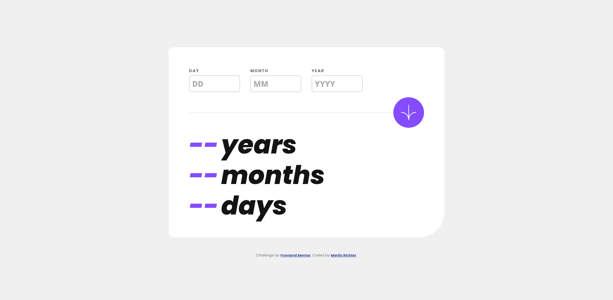
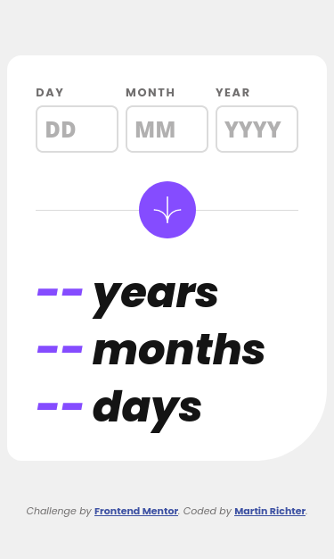
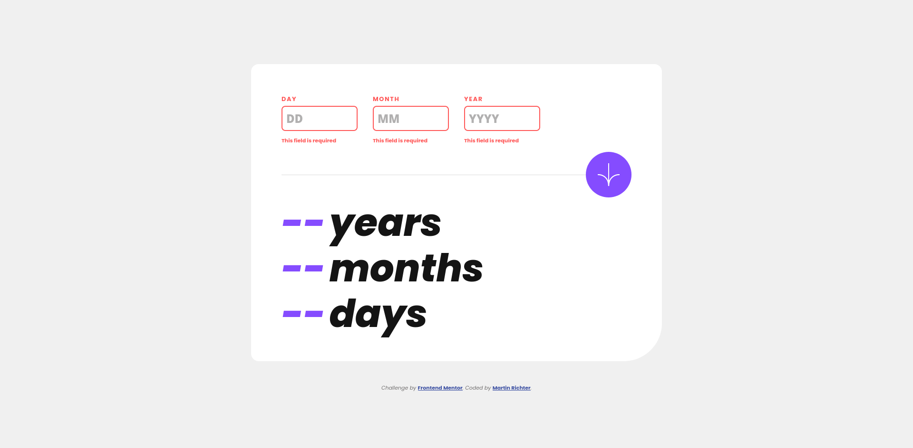
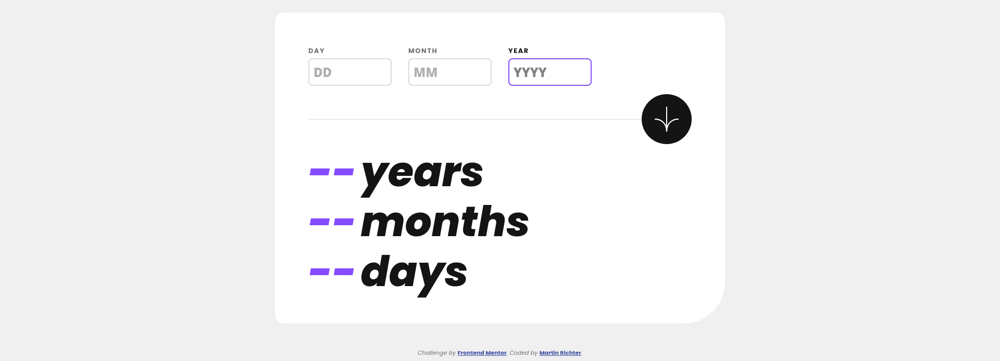

# Frontend Mentor - Age calculator app solution

This is a solution to the [Age calculator app challenge on Frontend Mentor](https://www.frontendmentor.io/challenges/age-calculator-app-dF9DFFpj-Q). Frontend Mentor challenges help you improve your coding skills by building realistic projects.

## Table of contents

-   [Overview](#overview)
    -   [The challenge](#the-challenge)
    -   [Screenshots](#screenshots)
    -   [Links](#links)
-   [My process](#my-process)
    -   [Built with](#built-with)
    -   [What I learned](#what-i-learned)
    -   [Continued development](#continued-development)
-   [Author](#author)

## Overview

### The challenge

Users should be able to:

-   View an age in years, months, and days after submitting a valid date through the form
-   Receive validation errors if:
    -   Any field is empty when the form is submitted
    -   The day number is not between 1-31
    -   The month number is not between 1-12
    -   The year is in the future
    -   The date is invalid e.g. 31/04/1991 (there are 30 days in April)
-   View the optimal layout for the interface depending on their device's screen size
-   See hover and focus states for all interactive elements on the page
-   **Bonus**: See the age numbers animate to their final number when the form is submitted

### Screenshots

### Links

-   Solution URL: [Add solution URL here](https://www.frontendmentor.io/solutions/age-calculator-app-9Eg--l5q8Q)
-   Live Site URL: [Add live site URL here](https://stunning-belekoy-80ce24.netlify.app/)

## My process

### Built with

-   Vite (https://vitejs.dev/)
-   Vue.js (https://vuejs.org/)
-   date-fns (https://classic.date-fns.org/)
-   Pinia (https://pinia.vuejs.org/)
-   Sass/Scss (https://sass-lang.com/)

### What I learned

I learned a little more about CSS Grid, and also about the Date Object in JS.
For example that the constructor takes year and day with "1" as the starting point while,
for some reason, month starts at "0". So "new Date(2020, 1, 1)" is not as expected "Jan. 1st 2020", but instead is "Feb. 1st 2020".

### Continued development

Need to look more into CSS-Grid and CSS in General.
For example the Transition I had planned for hover and focus states still does not work.

## Author

-   Frontend Mentor - [@Karag2006](https://www.frontendmentor.io/profile/Karag2006)
-   GitHub - [Karag2006](https://github.com/Karag2006)
-   GitLab - [@martin.richter2006](https://gitlab.com/martin.richter2006)
-   Twitter - [@karag2006](https://www.twitter.com/karag2006)
-   Mastodon - [@karag@fosstodon.org](https://fosstodon.org/@karag)
